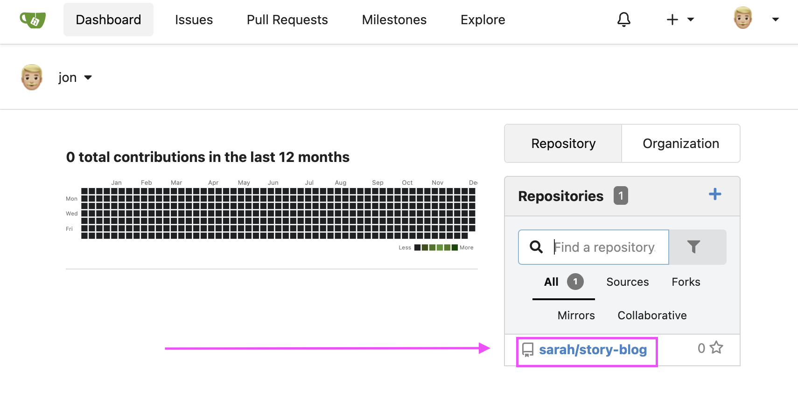

# Day 023: Fork a Git Repository

**Time**: 3 minutes

## Objective
Fork a git repository under another user

## Technologies Used
- gitea

## Steps

1. Log into gitea, navigate to desired repository

    

2. Click **Fork** on the repo

    

3. Confirm with **Fork Repository**

    

## Key Takeaways
- Nothing really to add, fairly straightforward.
